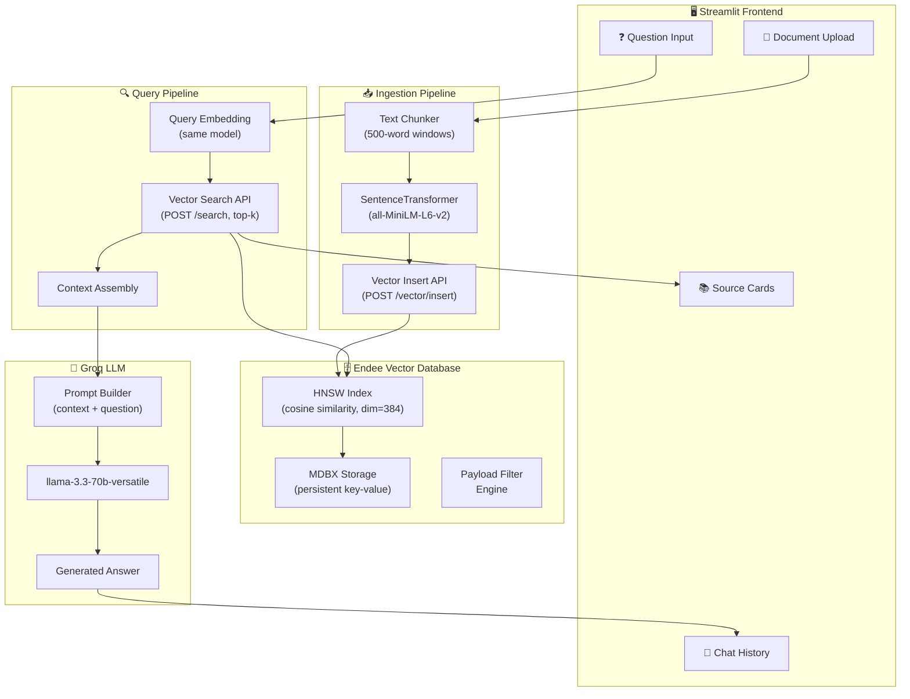
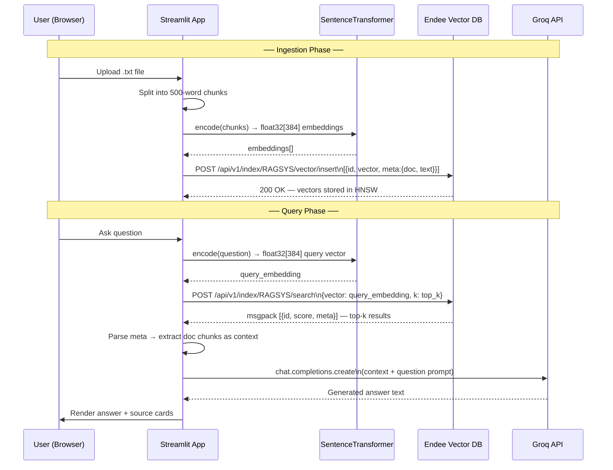
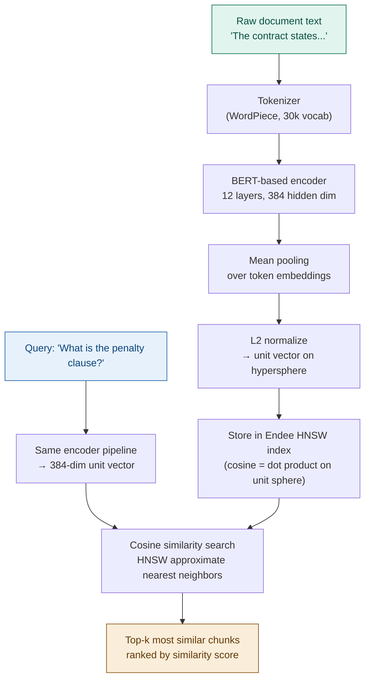
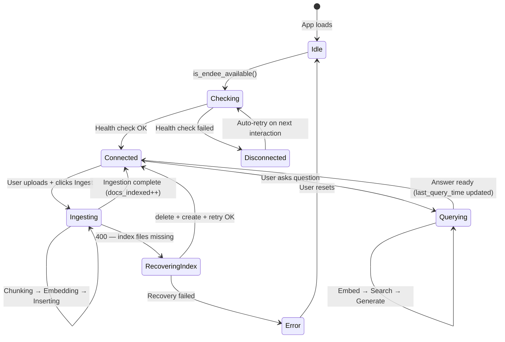
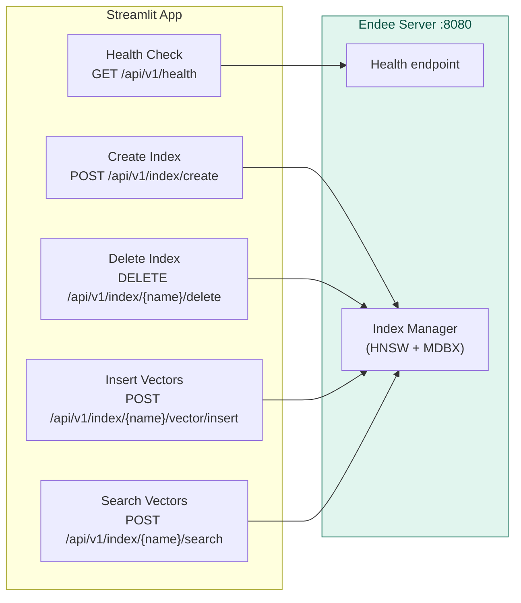
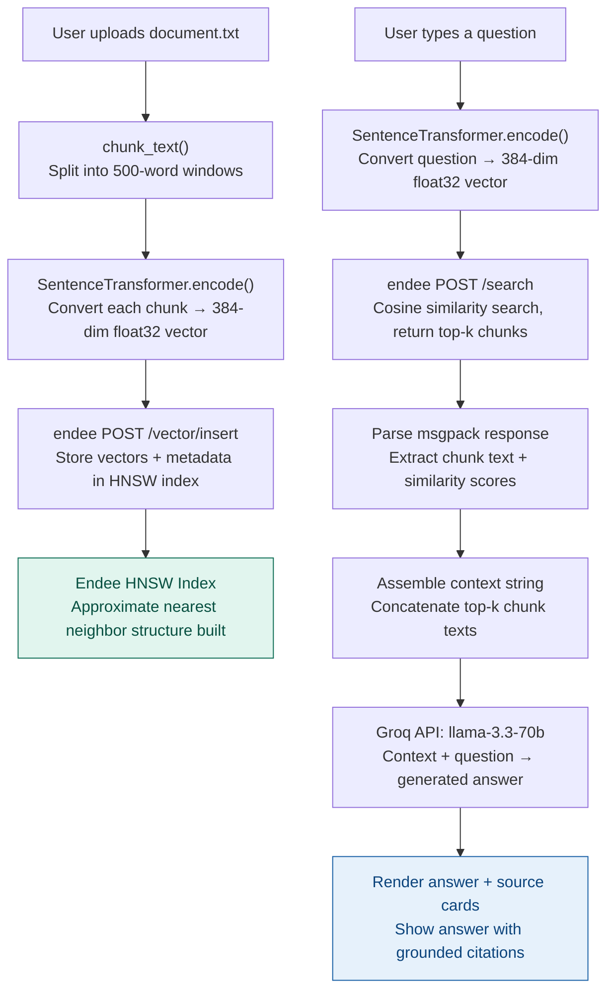
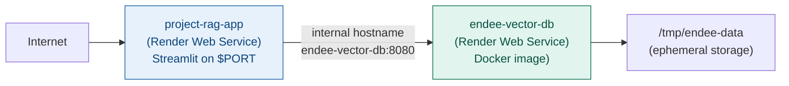

# 🧠 RAG Document Assistant

**Retrieval-Augmented Generation (RAG) application** built with Streamlit, Endee Vector Database, and Groq LLM — developed as part of the Endee.io Campus Recruitment Assignment.

[](https://youtu.be/zrxBGdZGPnc)

<p align="center">
  <a href="https://youtu.be/zrxBGdZGPnc">
    
  </a>
  <br>
  <b>▶ Watch Demo Prototype</b>
</p>

---

## 📋 Table of Contents

- [Project Overview](#project-overview)
- [Problem Statement](#problem-statement)
- [System Architecture](#system-architecture)
- [How Endee Vector Database is Used](#how-endee-vector-database-is-used)
- [Technical Deep Dive](#technical-deep-dive)
- [Project Structure](#project-structure)
- [Technology Stack](#technology-stack)
- [Setup & Installation](#setup--installation)
- [Running the Application](#running-the-application)
- [Environment Variables](#environment-variables)
- [Usage Guide](#usage-guide)
- [RAG Pipeline Explained](#rag-pipeline-explained)
- [API Reference](#api-reference)
- [Deployment on Render](#deployment-on-render)
- [Troubleshooting](#troubleshooting)

---

## Project Overview

This project is a **Retrieval-Augmented Generation (RAG)** system — a production-style AI application that allows users to upload text documents, store them as vector embeddings in **Endee Vector Database**, and then ask natural-language questions. The system retrieves the most semantically relevant document chunks and feeds them as context to a **Groq-hosted LLM** to generate accurate, grounded answers.

The core innovation of RAG is that the LLM does not rely on training data alone — it actively retrieves from a user-provided knowledge base at inference time. This makes answers current, domain-specific, and traceable to source documents.

### What makes this production-grade?

- **Semantic search** instead of keyword matching — the system finds the *meaning* of a question, not just matching words.
- **Chunked document ingestion** — large documents are split into overlapping windows and each chunk is independently searchable.
- **Vector similarity search** at the retrieval layer powered by Endee's high-performance HNSW index.
- **Source attribution** — every answer displays the exact document chunks that were used to generate it.
- **Auto-recovery** — the system detects when Endee has lost index files (common on ephemeral/free cloud hosts) and automatically recreates the index and retries ingestion.

---

## Problem Statement

Large Language Models hallucinate when asked questions about proprietary, recent, or domain-specific documents they were never trained on. The solution is RAG: ground the LLM in a trusted, searchable knowledge base at query time.

**Concrete use case:** A legal team uploads hundreds of contract PDFs. A user asks, "What is the penalty clause in the Acme agreement?" The system semantically retrieves the right clause and the LLM answers accurately — without the LLM ever having seen the contract during training.

This project demonstrates this capability with `.txt` documents, Endee as the vector store, and Groq's `llama-3.3-70b-versatile` as the generation backbone.

---

## System Architecture

### High-Level Architecture



---

### Detailed Data Flow



---

### Component Breakdown

```mermaid
graph LR
    subgraph FE["Frontend Layer"]
        A1["inject_theme()\nDark CSS injection"]
        A2["render_sidebar()\nSettings + status"]
        A3["render_header()\nBranding + divider"]
        A4["render_metrics()\nDocs / chunks / latency"]
        A5["render_sources()\nSource attribution cards"]
    end

    subgraph BL["Business Logic Layer"]
        B1["chunk_text()\n500-word windows"]
        B2["ingest_document()\nFull ingestion pipeline"]
        B3["search_similar()\nVector search + parse"]
        B4["generate_answer()\nGroq completion"]
        B5["parse_meta()\nMulti-format parser"]
    end

    subgraph IO["I/O & Connectivity"]
        C1["endee_headers()\nAuth token injection"]
        C2["is_endee_available()\nHealth check"]
        C3["create_index()\nIndex provisioning"]
        C4["delete_index()\nSafe cleanup"]
        C5["load_embedding_model()\nCached ST model"]
    end

    FE --> BL --> IO
```



---

### Embedding & Similarity Search Flow



---

### State Management



---

## How Endee Vector Database is Used

Endee is the **central retrieval engine** of this application. Every document chunk that gets ingested is converted to a 384-dimensional float32 vector and stored in Endee's HNSW (Hierarchical Navigable Small World) index. At query time, the user's question is converted to the same vector space and Endee returns the closest matching chunks in milliseconds.

### Index Configuration

When the application starts, it provisions an index in Endee with the following parameters:

| Parameter | Value | Reason |
|-----------|-------|--------|
| `index_name` | `RAGSYS` | Unique namespace for this application |
| `dim` | `384` | Matches `all-MiniLM-L6-v2` output dimension |
| `space_type` | `cosine` | Best for semantic similarity of normalized text embeddings |
| `precision` | `float32` | Full-precision embeddings for maximum accuracy |
| `M` | `16` | HNSW connectivity — higher = better recall, more RAM |
| `ef_con` | `200` | Construction-time search width — higher = better index quality |

### Vector Storage Schema

Each vector inserted into Endee carries:
- **`id`**: A unique string combining the document name, Unix timestamp, and chunk index (e.g., `contract.txt-1710000000-12`). This ensures idempotent re-ingestion does not create duplicate IDs.
- **`vector`**: The 384-dimensional float32 embedding from `all-MiniLM-L6-v2`.
- **`meta`**: A JSON-encoded string containing `doc` (the filename) and `text` (the raw chunk text). This is stored alongside the vector and returned with search results, enabling source attribution.

### Search and Retrieval

At query time, the application calls Endee's search endpoint:

```
POST /api/v1/index/RAGSYS/search
Body: { "vector": [0.12, -0.34, ...], "k": 3 }
```

Endee returns results encoded in **MessagePack** (a compact binary JSON alternative), which the application decodes using the `msgpack` library. The `parse_meta` function handles three possible formats that Endee may return metadata in: raw dict, JSON string, or bytes — making the application robust against Endee version differences.

### Auto-Recovery Logic

On ephemeral cloud deployments (like Render's free tier), the Endee process may restart and lose its index files while the MDBX metadata database persists. This causes Endee to return a `400 "required files missing for index"` error on insert. The application detects this exact error message, calls `delete_index()` to clean up stale metadata, calls `create_index()` to reprovision the index, and retries the insert — all transparently to the user.

### Endee API Calls Summary



---

## Technical Deep Dive

### Text Chunking Strategy

The `chunk_text` function splits documents into non-overlapping 500-word windows. The chunk size is configurable via a sidebar slider (200–900 words). Smaller chunks give more precise retrieval at the cost of missing broader context; larger chunks give more context per result but may dilute the similarity signal.

Each chunk is independently embedded and stored as a separate vector. When search returns top-k results, the `k` most relevant chunks are concatenated into a single context string passed to the LLM.

### Embedding Model

The application uses `sentence-transformers/all-MiniLM-L6-v2` — a compact, fast BERT-based model that produces 384-dimensional sentence embeddings. It is loaded once at startup using `@st.cache_resource` so it is not re-loaded on every Streamlit rerun. The model is downloaded automatically by the `sentence-transformers` library on first use.

The same model encodes both the stored chunks (at ingestion time) and the user's query (at search time). This symmetry is critical — the query and the stored chunks must live in the same vector space for cosine similarity to be meaningful.

### LLM Prompt Construction

The prompt sent to Groq follows a simple but effective RAG template:

```
Use the context below to answer the question.

Context:
{concatenated top-k chunks}

Question: {user question}

Answer:
```

The model is `llama-3.3-70b-versatile` with a configurable temperature (0.0–1.0, default 0.3). Low temperature produces more factual, deterministic answers suitable for document Q&A. Higher temperature encourages more creative synthesis.

### MessagePack Response Parsing

Endee returns search results in MessagePack format (MIME type `application/x-msgpack`). The `parse_meta` function handles multiple response shapes because Endee may return:
1. A list of dicts with `meta` as a JSON string
2. A list of lists where index 1 is the score and index 2 is meta
3. Meta as bytes that must be UTF-8 decoded first

This defensive parsing ensures the application works correctly across different Endee versions and response formats.

---

## Project Structure

```
project-RAG/
│
├── app.py                  # Main Streamlit application
│   ├── inject_theme()      # Premium dark CSS styling
│   ├── init_state()        # Session state initialization
│   ├── endee_headers()     # Auth header builder
│   ├── is_endee_available()# Health check
│   ├── load_embedding_model() # Cached ST model loader
│   ├── create_index()      # Endee index provisioning
│   ├── delete_index()      # Endee index cleanup
│   ├── chunk_text()        # Document chunking
│   ├── ingest_document()   # Full ingestion pipeline
│   ├── parse_meta()        # Multi-format metadata parser
│   ├── search_similar()    # Vector search + result parsing
│   ├── generate_answer()   # Groq LLM completion
│   ├── status_badge()      # Sidebar status HTML
│   ├── render_header()     # App header UI
│   ├── render_sidebar()    # Settings + system status sidebar
│   ├── render_metrics()    # Real-time metrics row
│   ├── render_sources()    # Source attribution cards
│   └── main()              # App entry point
│
├── ingest.py               # Standalone batch PDF ingestor (CLI tool)
├── query.py                # Standalone query engine (CLI tool)
├── requirements.txt        # Python dependencies
├── .env.example            # Environment variable template
├── .env                    # Your local secrets (git-ignored)
└── .gitignore              # Ignores .env, __pycache__, etc.
```

---

## Technology Stack

| Component | Technology | Purpose |
|-----------|------------|---------|
| UI Framework | Streamlit | Interactive web application |
| Vector Database | Endee (endee.io) | High-performance vector storage and search |
| Embedding Model | all-MiniLM-L6-v2 | Text → 384-dim vector conversion |
| LLM Provider | Groq API | Fast LLM inference (llama-3.3-70b) |
| HTTP Client | requests | REST API calls to Endee and Groq |
| Serialization | msgpack | Decoding Endee search responses |
| Env Management | python-dotenv | Loading `.env` secrets |
| Numerical | numpy | Float32 array handling |

---

## Setup & Installation

### Prerequisites

- Python 3.9 or newer
- Endee server running locally or on a remote host (see below)
- A Groq API key — free at [console.groq.com](https://console.groq.com)
- Git

---

### Step 1 — Clone the Repository

```bash
git clone https://github.com/YOUR_USERNAME/YOUR_REPO.git
cd YOUR_REPO/project-RAG
```

> **Required for Endee assignment evaluation**: Before doing anything else, star and fork the official Endee repository:
> 1. Go to [https://github.com/endee-io/endee](https://github.com/endee-io/endee)
> 2. Click **Star** ⭐
> 3. Click **Fork** — this creates your own copy
> 4. Build your project using the forked repository as the base

---

### Step 2 — Start Endee Vector Database

The application requires Endee to be running before it can ingest or search documents. The fastest way is Docker:

```bash
docker run \
  --ulimit nofile=100000:100000 \
  -p 8080:8080 \
  -v ./endee-data:/data \
  --name endee-server \
  --restart unless-stopped \
  endeeio/endee-server:latest
```

Verify Endee is running:

```bash
curl http://localhost:8080/api/v1/health
```

You should receive a `200 OK` response.

---

### Step 3 — Install Python Dependencies

```bash
pip install -r requirements.txt
```

The `requirements.txt` installs:
- `streamlit` — web UI framework
- `sentence-transformers` — embedding model (downloads ~90MB on first run)
- `groq` — Groq Python SDK
- `requests` — HTTP client
- `numpy` — array handling
- `python-dotenv` — `.env` file loader
- `msgpack` — Endee response decoder

---

### Step 4 — Configure Environment Variables

```bash
cp .env.example .env
```

Edit `.env` with your credentials:

```env
GROQ_API_KEY=gsk_xxxxxxxxxxxxxxxxxxxx
ENDEE_URL=http://localhost:8080
INDEX_NAME=RAGSYS
```

See [Environment Variables](#environment-variables) for all options.

---

## Running the Application

```bash
streamlit run app.py
```

Open your browser at **[http://localhost:8501](http://localhost:8501)**.

The sidebar shows real-time system status. All three status indicators (Vector DB Connected, LLM API Loaded, Documents Indexed) must be green before querying.

---

## Environment Variables

| Variable | Required | Default | Description |
|----------|----------|---------|-------------|
| `GROQ_API_KEY` | Yes | — | Your Groq API key from console.groq.com |
| `ENDEE_URL` | No | `http://localhost:8080` | Full URL to the Endee server |
| `ENDEE_HOSTPORT` | No | — | Alternative to ENDEE_URL — used for Render internal networking (e.g., `endee-vector-db:8080`) |
| `INDEX_NAME` | No | `RAGSYS` | Name of the vector index in Endee |
| `ENDEE_AUTH_TOKEN` | No | `""` | Auth token if Endee was started with `NDD_AUTH_TOKEN` |

The `ENDEE_URL` takes precedence over `ENDEE_HOSTPORT`. If neither is set, the application defaults to `http://localhost:8080`.

---

## Usage Guide

### Ingesting a Document

1. Ensure Endee is running and the **Vector DB Connected** indicator is green.
2. Click **Initialize Index** on first use (or if the index was lost).
3. Under **Document Upload**, click **Browse files** and select a `.txt` file.
4. Adjust the **Chunk Size** slider if needed (default 500 words).
5. Click **Ingest Document**.
6. The status panel shows: Reading → Embedding → Storing → Complete.
7. The **Chunks Stored** metric updates with the number of vectors added.

### Asking a Question

1. Scroll to **Ask Question**.
2. Type your question in the text area.
3. Adjust **Top-K** (how many source chunks to retrieve) and **Temperature** (LLM creativity).
4. Click **Ask Question**.
5. The answer appears in the **Answer** section.
6. The **Retrieved Sources** panel below shows the exact document chunks used to generate the answer, with similarity scores.

---

## RAG Pipeline Explained



The RAG pipeline has two distinct phases that share the embedding model but serve different purposes:

**Ingestion** converts every document chunk into a vector and stores it in Endee's persistent HNSW index. This only happens once per document.

**Retrieval & Generation** converts the user's question into a vector, finds the most similar stored chunks using Endee's approximate nearest neighbor search, and passes those chunks as context to the LLM. The LLM never operates without grounding — it always has the retrieved document context.

---

## API Reference

The application communicates with the following Endee REST endpoints:

| Method | Endpoint | Used In | Description |
|--------|----------|---------|-------------|
| `GET` | `/api/v1/health` | `is_endee_available()` | Liveness check |
| `POST` | `/api/v1/index/create` | `create_index()` | Provision HNSW index |
| `DELETE` | `/api/v1/index/{name}/delete` | `delete_index()` | Remove index (used during auto-recovery) |
| `POST` | `/api/v1/index/{name}/vector/insert` | `ingest_document()` | Batch insert vectors with metadata |
| `POST` | `/api/v1/index/{name}/search` | `search_similar()` | Approximate k-NN search by cosine similarity |

All requests include an `Authorization` header if `ENDEE_AUTH_TOKEN` is set. Insert and search requests include `Content-Type: application/json`.

---

## Deployment on Render

The repository includes a `render.yaml` blueprint for deploying both Endee and the Streamlit app on Render's free tier.



### Render Deployment Steps

1. Push your repository to GitHub.
2. Go to [render.com](https://render.com) → New → Blueprint.
3. Connect your GitHub repo.
4. Render reads `render.yaml` and provisions both services.
5. Set the `GROQ_API_KEY` environment variable when prompted.
6. Deploy. The `ENDEE_HOSTPORT` is automatically populated from the Endee service's internal hostname.

> **Note:** Render's free tier uses ephemeral storage. Endee's index files will be lost on restart. The application's auto-recovery logic handles this transparently — it detects the missing index and recreates it before retrying your document insert.

---

## Troubleshooting

### Vector DB shows "OFF" in sidebar

- Check that the Endee server is running: `docker ps` or `curl http://localhost:8080/api/v1/health`
- Verify `ENDEE_URL` in your `.env` matches the actual server address
- If using Docker, confirm port `8080` is mapped: `-p 8080:8080`

### "400 required files missing for index" error

This is expected on ephemeral deployments. The application auto-recovers by deleting the stale index entry and recreating it. If auto-recovery fails, click the page's **Initialize Index** button manually.

### Embedding model download hangs

`sentence-transformers` downloads ~90MB model files on first use. They are cached at `~/.cache/torch/sentence_transformers/`. Ensure you have internet access and ~500MB of disk space.

### Groq API errors

- Verify `GROQ_API_KEY` is correctly set in `.env`
- Check your Groq rate limit at [console.groq.com](https://console.groq.com)
- The free tier has generous limits for `llama-3.3-70b-versatile`

### No results returned from search

- Make sure you have ingested at least one document before querying
- Check the **Chunks Stored** metric in the metrics row
- If it shows 0, re-ingest your document

## License

This project is built on top of the Endee open-source vector database, licensed under the **Apache License 2.0**. See [LICENSE](../LICENSE) for details.

---

*Built for the Endee.io Campus Recruitment Drive*
