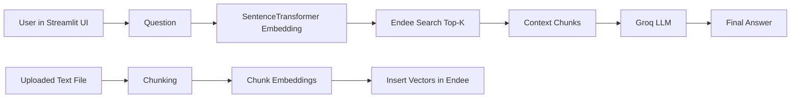

# Project-RAG: Streamlit + Endee + GroqWWW

RAG (Retrieval-Augmented Generation) app that:
- ingests `.txt` documents,
- stores embeddings in Endee vector DB,
- retrieves relevant chunks,
- generates final answers using Groq.

## Architecture



## Tech Stack

- Streamlit
- sentence-transformers (`all-MiniLM-L6-v2`)
- Endee vector database
- Groq API

## Local Setup

1. Install dependencies:
```bash
cd project-RAG
pip install -r requirements.txt
```

2. Create `.env`:
```bash
cp .env.example .env
```

3. Configure `.env`:
```env
GROQ_API_KEY=your_groq_api_key
ENDEE_URL=http://localhost:8080
INDEX_NAME=RAGSYS
```

4. Start Endee on `http://localhost:8080`.

5. Run the app:
```bash
streamlit run app.py
```

6. Open `http://localhost:8501`.

## Environment Variables

- `GROQ_API_KEY`: required for LLM responses.
- `INDEX_NAME`: index used in Endee.
- `ENDEE_URL`: full Endee URL (preferred).
- `ENDEE_HOSTPORT`: optional `host:port` form (useful in Render internal networking).
- `ENDEE_AUTH_TOKEN`: optional auth token if Endee auth is enabled.

## Render Deployment

Use the Blueprint file [`../render.yaml`](../render.yaml) to deploy:
- `endee-vector-db`
- `project-rag-app`

Steps:
1. Push repo to GitHub.
2. In Render, create a new Blueprint from the repo.
3. Provide `GROQ_API_KEY`.
4. Deploy and open the `project-rag-app` URL.

## Usage

1. Click `Initialize Index`.
2. Upload a `.txt` file.
3. Click `Ingest Document`.
4. Ask questions in the input box.
